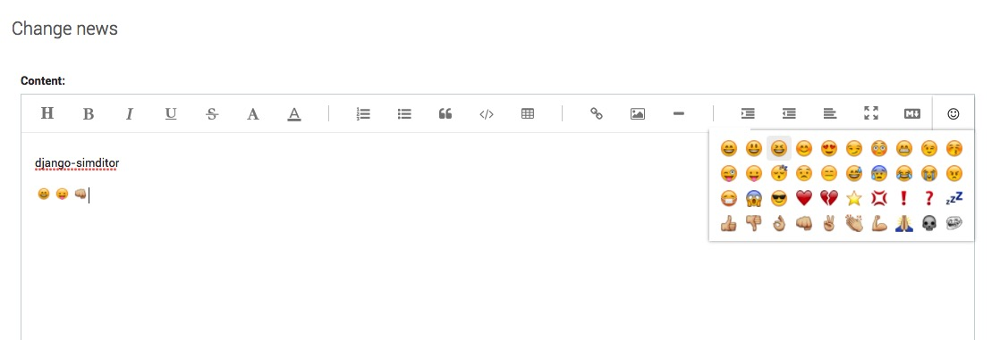
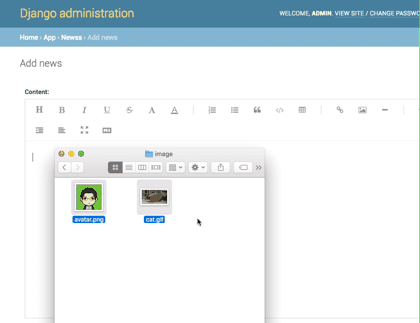
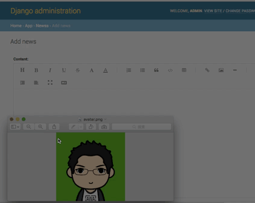
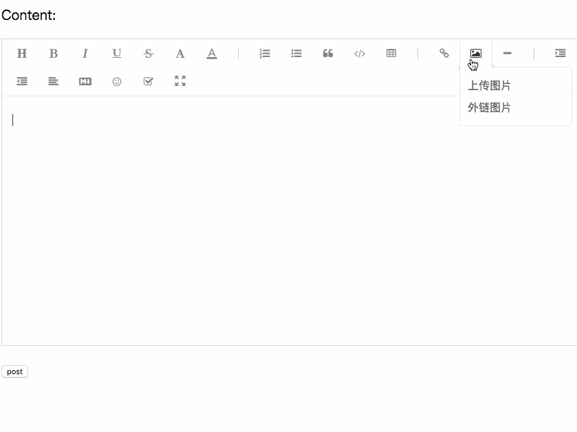

# django-simditor
django simditor

Installation
------------

```bash
pip install django-simditor
```

**Add `simditor` to your `INSTALLED_APPS` setting.**

```python
from django.db import models
from simditor.fields import RichTextField


class Post(models.Model):
    content = RichTextField()
```

**emoji**



**Markdown**


**Image upload config**

*drop image*



*clipboard image*




`urls.py`


```python
urlpatterns = [
    url(r'^admin/', admin.site.urls),
    url(r'^simditor/', include('simditor.urls'))   # add this line
]
```

`settings.py`

```python
INSTALLED_APPS = [
    'django.contrib.admin',
    'django.contrib.auth',
    'django.contrib.contenttypes',
    'django.contrib.sessions',
    'django.contrib.messages',
    'django.contrib.staticfiles',

    'simditor'
]

SIMDITOR_UPLOAD_PATH = 'uploads/'
SIMDITOR_IMAGE_BACKEND = 'pillow'

SIMDITOR_TOOLBAR = [
    'title', 'bold', 'italic', 'underline', 'strikethrough', 'fontScale',
    'color', '|', 'ol', 'ul', 'blockquote', 'code', 'table', '|', 'link',
    'image', 'hr', '|', 'indent', 'outdent', 'alignment', 'fullscreen',
    'markdown', 'emoji'
]

SIMDITOR_CONFIGS = {
    'toolbar': SIMDITOR_TOOLBAR,
    'upload': {
        'url': '/simditor/upload/',
        'fileKey': 'upload',
        'image_size': 1024 * 1024 * 4   # max image size 4MB
    },
    'emoji': {
        'imagePath': '/static/simditor/images/emoji/'
    }
}
```

## without django admin demo



```python
from django.views import generic
from django.views.decorators.csrf import csrf_exempt

from simditor.views import upload_handler


class ImageUploadView(generic.View):
    """ImageUploadView."""

    http_method_names = ['post']

    def post(self, request, **kwargs):
        """Post."""
        return upload_handler(request)


urlpatterns = [
    url(r'^$', IndexView.as_view(), name='simditor-form'),
    url(r'^simditor/upload', csrf_exempt(ImageUploadView.as_view())),
]
```

```python
# IndexView
from django import forms

from django.views import generic

from simditor.fields import RichTextFormField
try:
    from django.urls import reverse
except ImportError:  # Django < 2.0
    from django.core.urlresolvers import reverse


class SimditorForm(forms.Form):
    content = RichTextFormField()


class IndexView(generic.FormView):
    form_class = SimditorForm

    template_name = 'index.html'

    def get_success_url(self):
        return reverse('simditor-form')
```

`index.html`

```html
<!DOCTYPE html>
<html lang="en">
<head>
    <meta charset="UTF-8">
    <title>Document</title>
</head>
<body>
    <form method="post" action="./">
        
        {{ form.media }}
        {{ form.as_p }}
        <p><input type="submit" value="post"></p>
    </form>
</body>
</html>
```

> more detail you can check simditor_demo
